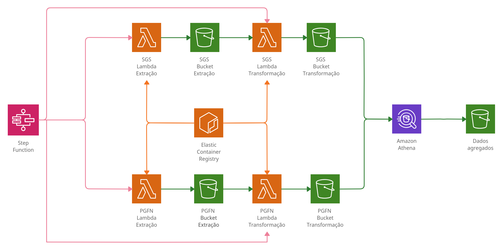

# [Data Challenge - Stone | Data Wrangling](https://drive.google.com/file/d/1D2e9djla0h920qy35fEQC44U0c9GnM7s/view?usp=sharing) 

Esse projeto utiliza a cloud da AWS. As seguintes ferramentas foram utilizadas:
- ECR
- S3
- Lambda
- Athena
- Step Functions

Demais recursos utilizados:

 - Para gerar facilmente toda essa infraestrutura foi utlizado o [Terraform](https://www.terraform.io/). 
 - As funções lambdas utlizam uma imagem [Docker](https://www.docker.com/). 
    
 - A imagem Docker utiliza o [Python 3.8](https://www.python.org/downloads/release/python-380/) 
para executar as funções.

- Esse projeto desenvolvido no SO [Linux Mint 20.1 (Ulyssa)](https://linuxmint.com/download.php). 
  É seguro dizer que qualquer SO baseado em Debian ou Ubuntu consiga executar inteiramente esse projeto.


### Para instalar as dependências, execute os seguintes comandos:
- Terraform: ```sudo make terraform```
- AWS CLI: ```sudo make aws```
- Docker: ```sudo make docker```

## Infraestrutura 
### Deploy
 Importante: No arquivos variables.tf foram definidas as variaveis "bucket_database_name" e "lambda_bucket_name". 
 Como o escopo dos nomes dos buckets S3 é global, adicione um prefixo aos nomes antes de dar daploy na infra.

Para o deploy execute os seguintes comandos estando na raiz do projeto:
1. ```terraform init```
2. ```terraform plan```
3. ```terraform apply```    

O processo deve durar no máximo 10 minutos. Pode ser que ele fique preso ao upar no ECR a imagem Docker das funções lambdas. 
Caso isso aconteça, tecle ctrl+c e depois execute ```terraform apply``` novamente.
Quando o deploy terminar, verifique pelo AWS Console os seguintes recursos criados:

- Cinco S3 Buckets com sufixos "sgs-extract", "sgs-transform", "pgfn-extract", "pgfn-transform" e "divida-database" 
- Quatro Funções Lambda com sufixos  "sgs-extract", "sgs-transform", "pgfn-extract" e "pgfn-transform"
- Um Repositório ECR com nome "lambda_image" e uma tag "latest"
- Duas Máquinas de estados do Step Functions, com nomes "sgs-pipeline" e "pgfn-pipeline"
- Um Athena Workgroup de nome "stone_data_challenge". Ele terá o database "divida" e as queries salvas 
  "create_table_devedores" e "create_table_indicadores"


Existem 2 pipelines independetens:
- SGS: ETL dos indicadores de crédito do [Sistema Gerenciador de Séries Temporais do Banco Central do Brasil](https://www3.bcb.gov.br/sgspub/localizarseries/localizarSeries.do?method=prepararTelaLocalizarSeries)
- PGFN: ETL dos dados de dívida ativa geral presente no [portal de dados abertos da Procuradoria-Geral da Fazenda Nacional](https://www.gov.br/pgfn/pt-br/assuntos/divida-ativa-da-uniao/dados-abertos)

O único ponto em que os 2 pipelines se econtram é no final, onde o Athena armazena o resultado das queries de ambos no 
bucket cujo sufixo é "divida-database".

### Undeploy

Para apagar toda a infraestrura montada, execute o comando ```terraform destroy```. Para facilitar o desenvolvimento 
do projeto, os buckets foram criados aceitando serem destruídos mesmo se possuindo conteúdo. Entretanto, pode ser que o 
processe iniciado por ```terraform destroy``` fique trancado ao tentar destruir algum bucket que possuir 
muitos dados. Durante o densenvolvimento isso aconteceu para mim no bucket "pgfn-transform". Para evitar isso, antes de aplicar o destroy, 
limpe o bucket "pgfn-transform". Atenção: apague o conteúdo do bucket, não o bucket. Deixe que o Terraform apague o bucket.

## ETL
### SGS
1. Extract: 
   - Os dados são extraídos do BC usando a [api fornecedida pela própria instituição](https://dadosabertos.bcb.gov.br/dataset/20570-saldo-da-carteira-de-credito-com-recursos-livres---pessoas-fisicas---total/resource/b67c9730-776c-4e32-b780-ed1f82adeb45).
   - O input para o processo de extração deve ser um json contendo o chave "codigo", cujo valor é uma lista de listas de inteiros, 
     sendos esses inteiros os códigos das séries temporais que se deseja extrair. Exemplo:```{"codigos": [[21388, 21389, 21390, 
     21391, 21392, 21393, 21394, 21395], [21396, 21397]]}```
   - Para cada inteiro presente na entrada será feito um request para a api do BC. O response da request será salvo como um json no 
     bucket com sufixo "sgs-extract".
2. Transform:
   - Todos os jsons presentes no bucket com sufixo "sgs-extract" são unidos num único dataframe que terá as colunas "data", "valor" e "codigo".  
     O dataframe é então particionado pela coluna "data", cujos particionamentos  serão armazenados no bucket com sufixo "sgs-transform".
    
3. Load: No Athena, utilizando a query salva "create_table_indicadores", é criado a tabela "divida.indicadores". 
   Os resultados das queries serão armazenados no bucket com sufixo "divida-database".


#### Máquina de estados - SGS


### PGFN
1. Extract: 
   - O input para o processo deve ser um json contendo os campos "origem" (uma lista de strings, cujo domínio é "fgts", "previdenciario" e "nao_previdenciario"), 
     "remessa" (uma string de data no formato YYYY-MM-DD) e "uf" (uma lista de strings cujo domínio é as unidades federativas do Brasil). Exemplo:
     ```{"origem": ["fgts", "previdenciario"],"remessa":  "2020-12-01", "uf": ["RS", "MG"]}```
   - Do portal da PGFN é extraido os conjuntos de dados selecionados através do campo "origem" do input.  
   - Os dados extraidos do portal estão em formato ZIP. Para não estourar a cota de 500 MB de disco rigido que 
     cada execução de função lambda possui, o download dos ZIPs e a extração dos seus CSVs é feito totalmente em memória ram.
   - Os CSVs extraídos são salvos no bucket de sufixo "pgfn-extract". 

2. Transform:
   - Os nomes da colunas são convertidos para letras mínusculas.
   - Nos CSVs haviam algumas linhas com a string "1000" como ano na coluna "data_inscricao". Decidi remover essas linhas porque 
     não sabia como lidar com elas.
   - As datas presentes na coluna "data_inscricao" foram convertidas para o formato "YYYY-MM-DD".
   - A partir da coluna "data_inscricao", foi criada a coluna "quarter" que identifica em qual trimestre está cada data 
     presente em "data_inscricao". Por exemplo: se numa linha houve o valor "2019-11-06", o valor de quarter 
     será "2019-10-01". Esta lógica de mapeamento se baseou no conteúdo desse [link](https://www.investopedia.com/terms/q/quarter.asp).
   - Foram criadas as colunas "remessa", que identica quando o PGFN disponibizou aqueles dados, e "origem", 
     que identica a origem de cada dívida.
   - Os dataframe são particionados primeiro pela coluna "quarter" e depois por "uf_unidade_responsavel", 
     e então armezenados no bucket de sufixo "pfgn-transform" . 
3. Load: No Athena, utilizando a query salva "create_table_devedores", é criado a tabela "divida.devedores". 
   Os resultados das queries serão armazenados no bucket com sufixo "divida-database".


#### Máquina de estados - PGFN


## Trigger ETL

Para simplicar o projeto, decidir colocar um gatilho manual para o ETL. 
Após gerar a infraestrutura, é necessário os seguintes procedimentos para iniciar o ETL:

1. Usando o AWS Console, selecione a [home do Step Functions](https://console.aws.amazon.com/states/home?region=us-east-1#/statemachines).
2. Lá terá 2 máquinas de estados: "sgs-pipeline" e "pfgn-pipeline".
    1. Execute "sgs-pipeline" passando o seguinte payload:```{"codigos": [[21388, 21389, 21390, 21391, 21392, 21393, 21394, 21395]]}```.
    2. Execute "pgfn-pipeline" passando o seguinte payload:
    ```
   {    
        "uf": ["AC", "AL", "AM", "AP", "BA", "CE", "DF", "ES", 
                "GO", "MA", "MT", "MS", "MG", "PA", "PB", "PR", "PE", 
                "PI", "RJ", "RN", "RO", "RS", "RR", "SC", "SP", "SE", "TO", "NA"],
        "origem": ["fgts", 
                   "previdenciario", 
                   "nao_previdenciario"], 
        "remessa": "2020-12-01"
   }
   ```
   
3. Após os processos terminarem, cada pipeline terá populado seus respectivos buckets extract e transform.

## Montagem e criação das tabelas no Athena

Não consegui integrar o Athena com o Step Functions. Eu conseguia executar as queries por ele, 
mas o processo retornava falha ao salvar o resultados das queries no bucket de sufixo "divida_database". 
O erro que acontecia era algo relacionado com o fato do bucket ser criptografado.  
Por isso, para popular o bucket, faça os seguintes procedimentos:

1. Na [home do Athena](https://console.aws.amazon.com/athena/home?region=us-east-1#query), 
   entre no workgroup "stone_data_challenge". Após isso clique em "Saved Queries" no topo da página.
   
2. As consultas salvas são "create_table_indicadores" e "create_table_devedores". 
   Clique em cada uma delas e as execute no editor de query.
3. Para montar as tabelas, execute:
   - ```MSCK REPAIR TABLE divida.indicadores;```
   - ```MSCK REPAIR TABLE divida.devedores;```
   
## Melhorias futuras

Mesmo abusando do pararelismo que o Step Functions proporciona, 
a execução da função "pgfn-transform" estoura o cota máximo de tempo do Lambda, que é 15 minutos, 
quando o input possui "SP" em uf e "nao_previdenciario" em origem. Para não prejudicar o ETL inteiro, decidi colocar no
código da função "pgfn-transform" um condicional para evitar essa combinação de parâmetros. Uma forma de resolver essa situação seria 
seria utlizar o [Fargate](https://aws.amazon.com/pt/fargate/?whats-new-cards.sort-by=item.additionalFields.postDateTime&whats-new-cards.sort-order=desc&fargate-blogs.sort-by=item.additionalFields.createdDate&fargate-blogs.sort-order=desc), já que ele é mais escalável que o Lambda.

## Material de apoio

 - https://www.youtube.com/watch?v=Knh6gLOGn3w&t=4164s
 - https://www.youtube.com/watch?v=FmLdqQMQHFs&t=3039s
 - https://www.youtube.com/watch?v=w6cqUhSdy-M
 - https://registry.terraform.io/providers/hashicorp/aws/latest/docs
 - https://docs.aws.amazon.com/index.html
 - https://github.com/byu-oit/terraform-aws-ecr-image


